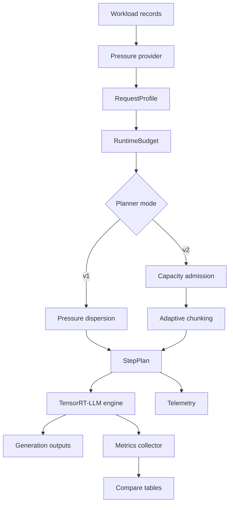
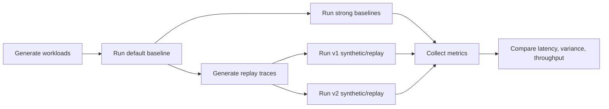

# TRT-LLM MoE Runtime Optimizer

[](https://github.com/NVIDIA/TensorRT-LLM)
[](#overview)
[](#core-design)
[](https://developer.nvidia.com/cuda-zone)

Pressure-aware admission, adaptive chunking, and runtime scheduling optimization for TensorRT-LLM MoE inference.

## Overview

`TRT-LLM MoE Runtime Optimizer` is a runtime engineering project for improving TensorRT-LLM MoE inference under expert and rank hotspot pressure. It provides a structured optimization pipeline for representing request pressure, building runtime budgets, selecting batches, controlling prefill behavior, and measuring the resulting latency-throughput tradeoff.

The project is organized around one systems question:

> When MoE routing creates expert or rank hotspots, should the runtime still optimize only for capacity and utilization, or should it explicitly budget pressure?

The implementation answers that question with two planner generations:

- `v1`: pressure dispersion, designed to prove that pressure is operationally useful
- `v2`: admission and adaptive chunking, designed to recover batching quality while retaining pressure awareness

## Capabilities

- Pressure-aware request profiling.
- Explicit runtime budgets and step plans.
- Pressure-dispersion scheduling.
- Admission control with dynamic pressure budgets.
- Adaptive chunking under MoE pressure.
- Replay-based pressure validation.
- Reproducible baseline and scheduler-variant evaluation.

## System Architecture



## Evaluation Pipeline



This structure keeps the project from becoming a one-off benchmark. Each scheduler variant is measured against the same workload set and summarized through the same metrics pipeline.

## Runtime Model

MoE step latency is modeled as:

```text
L(B) = C(T(B)) + Q(P(B), S(B), phase(B))
```

where:

- `B` is a candidate batch
- `T(B)` is token volume
- `P(B)` is aggregate MoE pressure
- `S(B)` is expert or rank skew
- `phase(B)` captures prefill/decode interaction
- `C` is compute cost
- `Q` is contention cost

Generic runtime knobs mostly act on `C(T(B))` and capacity constraints. This project adds mechanisms for controlling `Q(P(B), S(B), phase(B))`.

The design relies on a practical observation: once routing pressure is concentrated enough, adding another hot request to the same step can increase tail latency more than it increases useful throughput. A pressure-aware runtime should therefore distinguish between a large healthy batch and a large unsafe batch.

## Core Design

### Pressure Provider

Implemented in:

- [`scheduler/moe_pressure.py`](scheduler/moe_pressure.py)
- [`scheduler/replay_pressure_provider.py`](scheduler/replay_pressure_provider.py)

The provider supplies request-level pressure metadata. Synthetic mode uses fixed classes; replay mode overlays trace-derived pressure records.

### Runtime Resource Model

Implemented in [`scheduler/resource_model.py`](scheduler/resource_model.py).

The project uses three explicit runtime objects:

| Object | Role |
| --- | --- |
| `RequestProfile` | Normalizes request state, token cost, pressure class, and pressure score. |
| `RuntimeBudget` | Stores per-step limits for batch size, tokens, pressure, prefill quota, and generation quota. |
| `StepPlan` | Captures selected requests, deferred requests, planned tokens, planned pressure, and planner notes. |

This interface lets the planner reason about pressure as a first-class resource.

### V1: Pressure Dispersion

Implemented in [`scheduler/moe_microbatch_scheduler.py`](scheduler/moe_microbatch_scheduler.py).

`v1` is intentionally conservative:

- prefer decode requests
- avoid stacking hot requests
- defer requests that exceed the pressure budget

It answers a basic validation question: if the runtime isolates pressure, does tail latency improve? The answer is yes, but the policy often over-isolates and loses throughput.

### V2: Admission and Adaptive Chunking

Implemented in:

- [`scheduler/moe_capacity_scheduler.py`](scheduler/moe_capacity_scheduler.py)
- [`scheduler/adaptive_chunking.py`](scheduler/adaptive_chunking.py)

`v2` adds a more balanced control layer. It scores pending requests using a utility-like function:

```text
score(r)
  =
  prefix_bonus(r)
  - alpha * pressure(r)
  - beta * token_cost(r)
  - gamma * hot_rank_penalty(r)
```

The planner then selects a batch under:

- maximum batch size
- token budget
- dynamic pressure budget
- optional repeated-prefix preference

Adaptive chunking adjusts effective batch shape when pressure or prefix reuse changes the quality of prefill insertion.

## Why the Method Is Effective

The expected behavior follows from a straggler and contention argument.

For an autoregressive decode step, the effective step latency is gated by the slowest participating work. If several requests route into the same hot expert or rank group, the slow path becomes more likely to dominate the whole step. Under a convex contention regime, concentrating hot requests produces a larger tail penalty than distributing them.

`v1` exploits this directly by isolating hot requests. Its latency wins validate the signal, but its throughput loss shows that isolation alone is not a complete runtime policy.

`v2` addresses the missing part. It keeps pressure in the decision path, but adds admission scoring and chunking control so the runtime can still batch requests when pressure and structure allow it. This is the key engineering distinction between a heuristic and a runtime scheduling design.

## Implementation Map

| File | Responsibility | Engineering rationale |
| --- | --- | --- |
| [`scheduler/moe_pressure.py`](scheduler/moe_pressure.py) | Synthetic pressure classes | Provides a portable pressure signal. |
| [`scheduler/replay_pressure_provider.py`](scheduler/replay_pressure_provider.py) | Replay pressure injection | Checks stability beyond direct synthetic labels. |
| [`scheduler/resource_model.py`](scheduler/resource_model.py) | Runtime planning contract | Makes request cost and budgets explicit. |
| [`scheduler/moe_microbatch_scheduler.py`](scheduler/moe_microbatch_scheduler.py) | V1 dispersion policy | Validates pressure as a scheduling signal. |
| [`scheduler/moe_capacity_scheduler.py`](scheduler/moe_capacity_scheduler.py) | V2 admission control | Recovers batching quality under pressure. |
| [`scheduler/adaptive_chunking.py`](scheduler/adaptive_chunking.py) | Prefill/chunking control | Prevents prefill from being inserted blindly under decode pressure. |
| [`scripts/run_full_matrix.sh`](scripts/run_full_matrix.sh) | End-to-end matrix runner | Makes the full evaluation matrix reproducible. |
| [`scripts/collect_metrics.py`](scripts/collect_metrics.py) | Metrics aggregation | Produces comparable result tables. |

## Evaluation

The measurements below were collected with:

- model: `Qwen/Qwen1.5-MoE-A2.7B-Chat`
- engine path: TensorRT-LLM `INT4 weight-only`
- GPU: `RTX 4060 Ti 16GB`

### Workloads

| Workload | Purpose |
| --- | --- |
| `Balanced MoE` | Non-regression control. |
| `Hot-Expert` | Expert hotspot stress case. |
| `Hot-Rank` | Rank hotspot stress case. |
| `Mixed Burst` | Non-stationary traffic with intermittent pressure spikes. |
| `Repeated-Prefix under MoE Pressure` | Prefix reuse structure combined with pressure skew. |

### Baselines

- default batching
- `GUARANTEED_NO_EVICT`
- `MAX_UTILIZATION`
- overlap / chunked prefill baseline

### Result Summary

| Workload | Candidate | Baseline E2E p90 | Candidate E2E p90 | Baseline Throughput | Candidate Throughput |
| --- | --- | ---: | ---: | ---: | ---: |
| Balanced | `MAX_UTILIZATION` | `1.4786s` | `1.4768s` | `280.39 tok/s` | `282.72 tok/s` |
| Balanced | `v2 replay` | `1.4786s` | `1.4541s` | `280.39 tok/s` | `305.78 tok/s` |
| Hot-Expert | `v1 replay` | `1.8421s` | `1.5698s` | `301.32 tok/s` | `98.43 tok/s` |
| Hot-Expert | `v2 replay` | `1.8421s` | `1.7928s` | `301.32 tok/s` | `169.64 tok/s` |
| Hot-Rank | `v1 replay` | `1.9107s` | `1.7123s` | `293.97 tok/s` | `100.07 tok/s` |
| Hot-Rank | `v2 replay` | `1.9107s` | `1.7186s` | `293.97 tok/s` | `99.26 tok/s` |
| Mixed Burst | `v2 replay` | `1.9723s` | `1.5660s` | `263.02 tok/s` | `184.46 tok/s` |
| Repeated-Prefix + Pressure | `v2 replay` | `1.7533s` | `1.2848s` | `242.35 tok/s` | `130.94 tok/s` |

### Interpretation

The data supports these conclusions:

1. Generic strong baselines are useful controls but do not solve hotspot-heavy MoE tail latency.
2. `v1` proves that pressure-aware scheduling can substantially reduce tail latency.
3. `v2` is the stronger engineering design because it introduces admission and chunking control, not only isolation.
4. `Mixed Burst` and `Repeated-Prefix under MoE Pressure` show the clearest benefit from the additional `v2` architecture.
5. `Hot-Rank` remains the hardest case for throughput recovery.

## Limitations

The quantitative path uses the real TensorRT engine backend with planner-driven batch composition. It is not a pure in-backend PyTorch scheduler benchmark.

The pressure source is also simplified. Synthetic and replay metadata are sufficient for validating the runtime design, but a production deployment would require live router telemetry or a calibrated pressure estimator.

## Repository Layout

- [`scheduler/`](scheduler): pressure model, resource model, admission logic, chunking control, telemetry
- [`scripts/`](scripts): matrix execution, replay generation, summarization
- [`workloads/`](workloads): fixed MoE workloads
- [`artifacts/moe_traces/`](artifacts/moe_traces): replay traces
- [`results/`](results): raw outputs and compare tables
- [`docs/`](docs): detailed notes and supporting reports

## Reproducibility

```bash
bash scripts/run_full_matrix.sh baseline-default
bash scripts/run_full_matrix.sh baseline-strong
bash scripts/run_full_matrix.sh traces
bash scripts/run_full_matrix.sh v1-synthetic
bash scripts/run_full_matrix.sh v1-replay
bash scripts/run_full_matrix.sh v2-ablation
bash scripts/run_full_matrix.sh qwen15-final
```

```bash
bash scripts/wsl_env.sh python scripts/collect_metrics.py ...
```

Reference material:

- [`docs/final_report.md`](docs/final_report.md)
- [`docs/result_summary.md`](docs/result_summary.md)
- [`results/compare_tables/selected_summary.md`](results/compare_tables/selected_summary.md)
